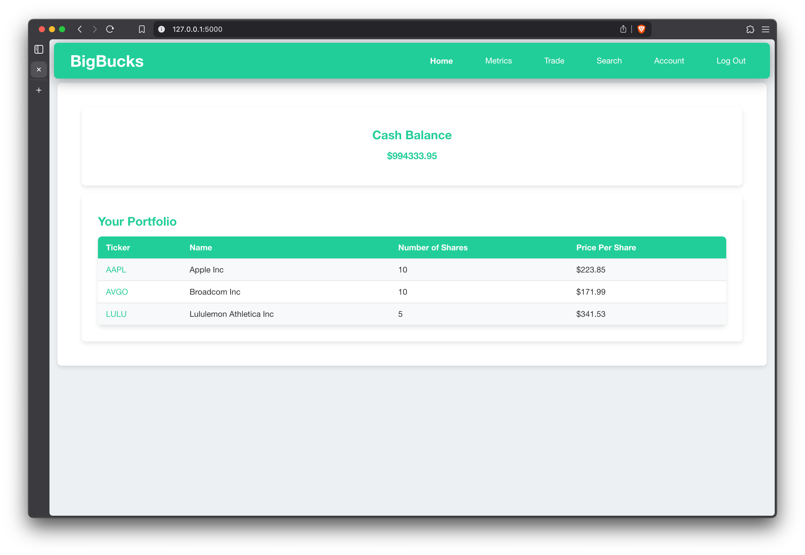
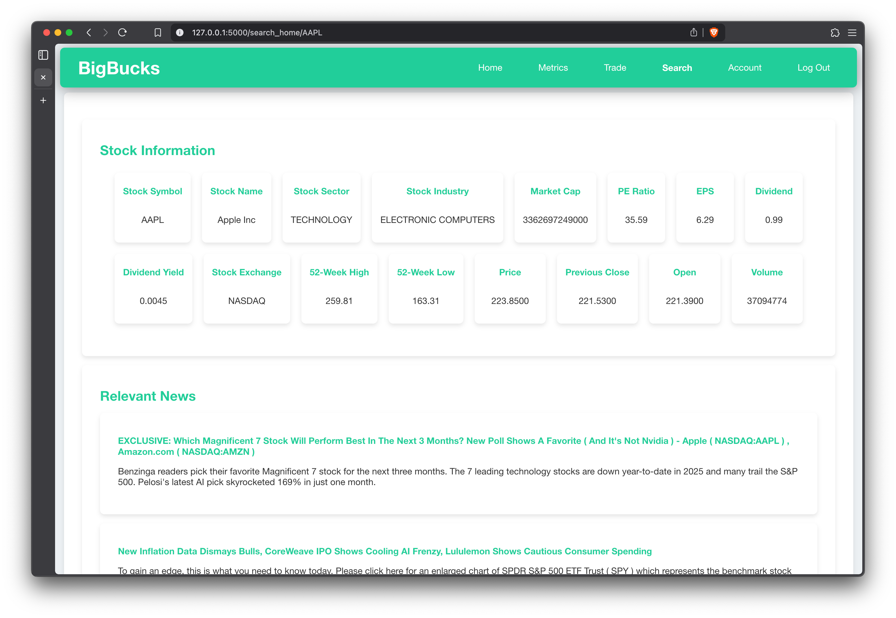
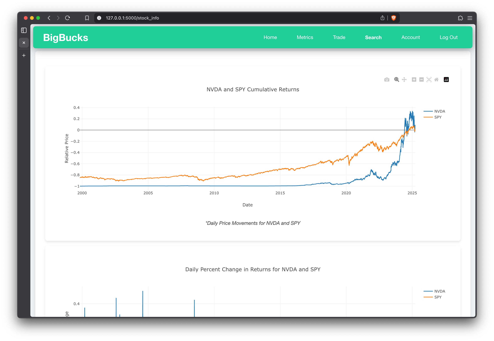
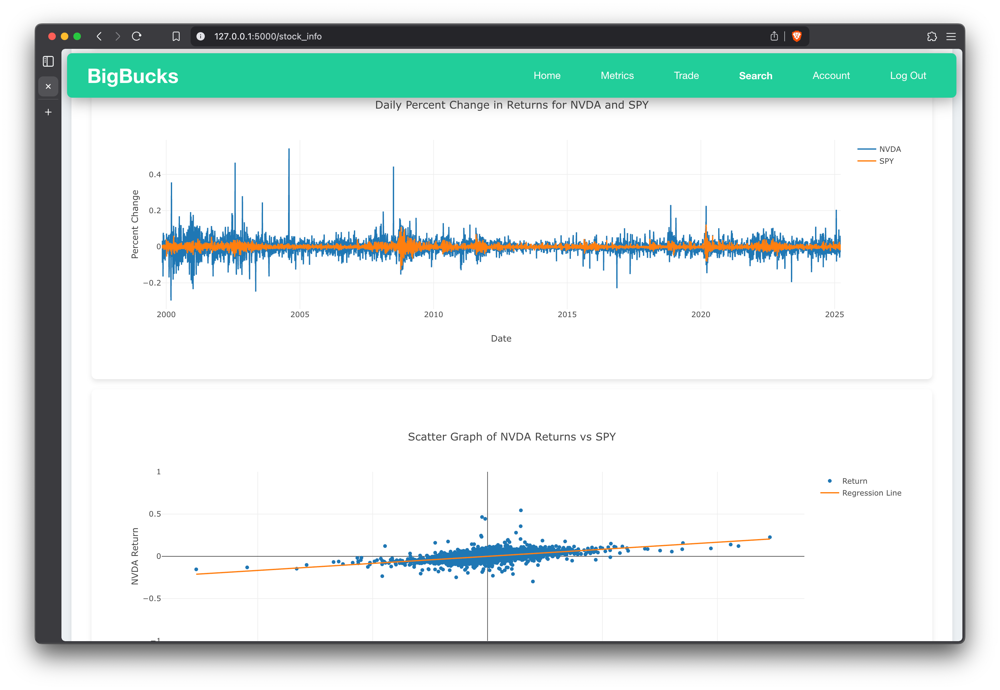
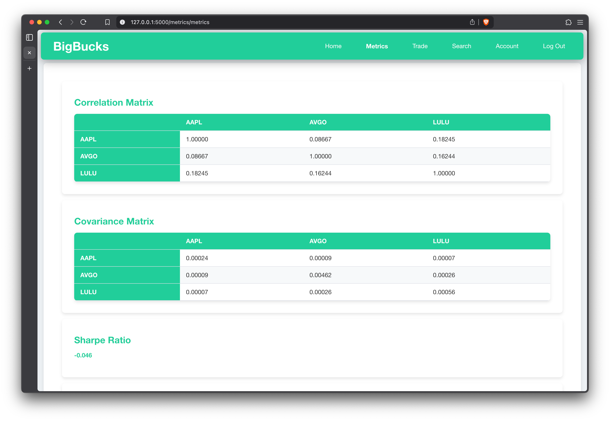
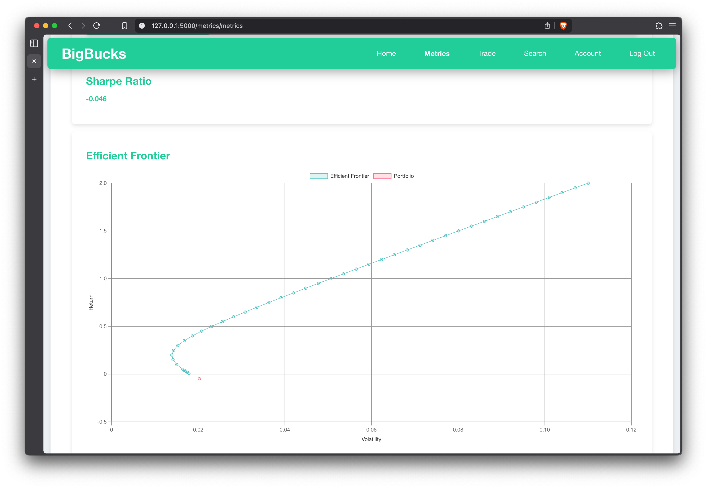

# BigBucks - Stock Trading Simulator

A robust web application that simulates stock market trading using real-time data from AlphaVantage API. Practice investing strategies with virtual money in a risk-free environment.

## Screenshots

### Home Dashboard


### Stock Search


### Stock Comparison



### Portfolio Metrics



## Features

- Real-time stock data integration
- Virtual portfolio management
- User authentication system
- Admin dashboard
- Transaction history tracking
- Advanced portfolio metrics (correlation matrices, covariance matrices, efficient frontier)
- Stock comparison against SPY

## Prerequisites

```plaintext
Python 3.x
Flask
SQLite
Requests
Pytest
Werkzeug
NumPy
Pandas
Click

## Installation

1. Clone the repository:
```bash
git clone https://github.com/yourusername/bigbucks.git
cd bigbucks
```

2. Install dependencies:
```bash
pip install -r requirements.txt
```

3. Configure API key:
```python
# bigbucks/config.py
API_KEY = "YOUR_ALPHAVANTAGE_API_KEY"
```

## Database Setup

Initialize a new database:
```bash
flask --app bigbucks init-db
```

**Note:** If you encounter database errors, delete the existing `.db` file and reinitialize.

## Usage

Start the development server:
```bash
flask --app bigbucks run --debug
```

### Standard User Access
1. Navigate to the application URL
2. Register a new account
3. Log in to access trading features

### Admin Access
Connect to the database and grant admin privileges:
```bash
sqlite3 stock_database.db
sqlite> UPDATE Users SET role = 'admin' WHERE userID = '<target_user_ID>';
```

## Development

### Testing
Run the test suite:
```bash
pytest
```

### Contributing
1. Fork the repository
2. Create a feature branch
3. Submit a pull request

## License

This project is licensed under the MIT License - see the LICENSE file for details.

## Acknowledgments

- AlphaVantage API for real-time market data
- Flask team for the excellent web framework
